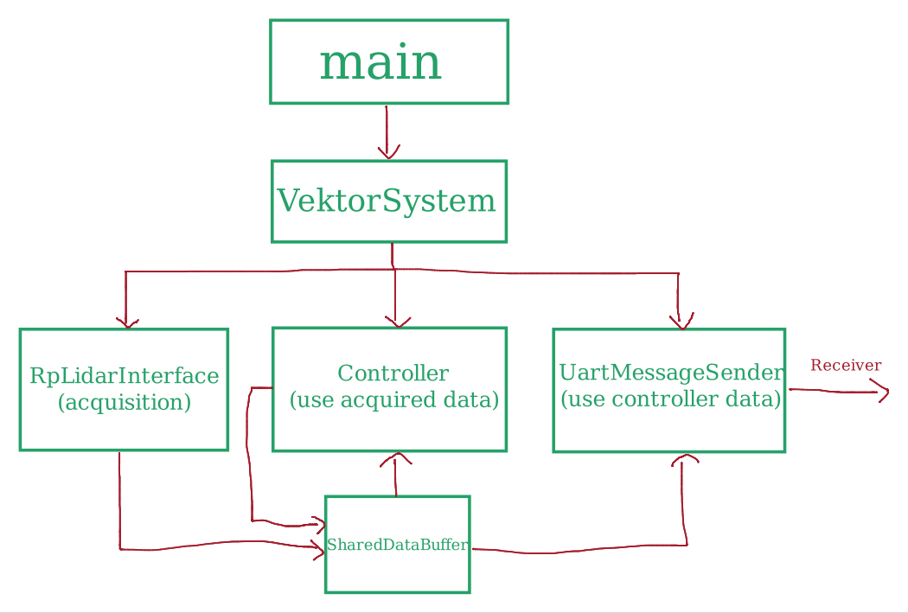
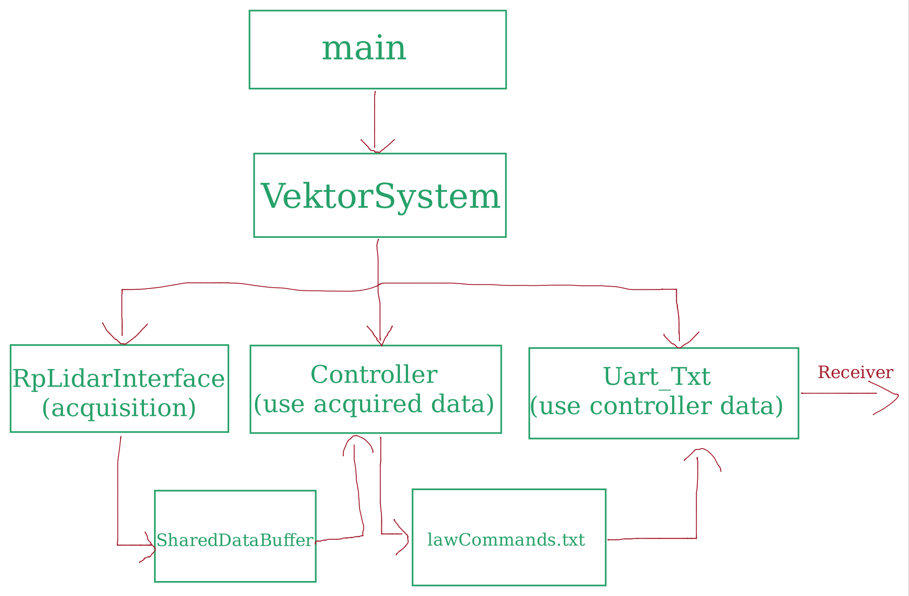

# Vektor-E: 1/10th Scale Autonomous Vehicle Control System

## 🎯 Project Overview

This repository hosts the C++ control system for a 1/10th scale autonomous vehicle. The project focuses on real-time LiDAR data processing for navigation and obstacle avoidance. It integrates Reinforcement Learning (RL) models, initially trained in the Webots simulation environment using the Tianshou library (Python), for autonomous driving capabilities on the physical vehicle.

Engineered a high-performance real-time LiDAR visualization tool in C++ for enhanced spatial awareness and obstacle detection. Implemented state-of-the-art RL algorithms using the Tianshou library in Python, with the autonomous driving model initially trained in the Webots simulation environment before deployment to the physical vehicle.

## ✨ Key Features

*   High-performance real-time LiDAR data processing and visualization for spatial awareness.
*   Autonomous driving logic implemented using state-of-the-art Reinforcement Learning algorithms.
*   RL models developed with the Tianshou library in Python.
*   Initial training and validation of driving models in the Webots simulation environment.
*   Deployment on a 1/10th scale physical vehicle, likely controlled by a Jetson Nano or similar embedded system.
*   Modular design with components for LiDAR data acquisition, control logic, and UART communication.

## 🏗️ System Architecture

The system architecture is designed for modularity and real-time performance. It typically involves a flow where LiDAR data is acquired, processed by a controller to generate driving commands, which are then sent to the vehicle's hardware via UART.

Refer to the following diagrams for a visual representation:
*   `ArchitectureRS.png`: System architecture for live operation with direct UART communication.
*   `ArchitectureRS_Txt.png`: System architecture variant, possibly for simulation or logging, using text files for command transfer (`lawCommands.txt`).




## 🧩 Core Components

The system is composed of several key C++ components:

*   **`VektorSystem` (`VektorSystem.cpp`, `VektorSystem.h`)**:
    *   Acts as the central orchestrator for the autonomous system.
    *   Initializes and manages the LiDAR interface, the controller, and the UART message sender.
*   **`Controller/`**:
    *   `Controller.cpp`, `Controller.h`: Implements the primary control logic. It acquires LiDAR data (`acquireLidarData`) from a shared buffer, processes it using `autoControlLogic` to determine appropriate driving actions (speed and steering), and outputs these as `LawCommand` objects to another shared buffer.
    *   `Controller_Txt.cpp`, `Controller_Txt.h`: A variant of the controller, likely designed for offline testing, simulation, or data logging. It might read Lidar data from a file or log its output commands.
    *   `vektor_controller.cpp`: Appears to be a standalone executable or an alternative main entry point that directly uses a `VehicleController` class (which itself inherits from a `Driver` class). This controller also implements `acquireLidarData` and `autoControlLogic`.
*   **`JetsonNanoUart/`**:
    *   `Uart.cpp`, `Uart.h`: Manages serial (UART) communication, presumably on a Jetson Nano. It takes `LawCommand` objects from a shared buffer and sends them to the vehicle's motor controller/actuators.
    *   `Uart_Txt.cpp`, `Uart_Txt.h`: A variant for UART communication, potentially for logging commands to a file (`lawCommands.txt`) or replaying them, rather than sending to actual hardware.
*   **`main.cpp`**:
    *   The main entry point for the primary autonomous driving application.
    *   Initializes `VektorSystem` with port and baud rate configurations for LiDAR communication.
*   **`server.cpp`**:
    *   (The exact role of `server.cpp` needs further clarification from code or documentation. It might be for remote telemetry, configuration, or debugging.)
*   **`main_test.cpp`**:
    *   Contains test code, possibly for unit testing UART functionalities or other components.

## 🔗 Git Submodules

This project utilizes Git submodules to manage external dependencies and modular components.

*   **`RL`**:
    *   Path: `RL`
    *   URL: `git@github.com:EvolvDK/Vektor-E_RL.git`
    *   Likely contains the Reinforcement Learning models, Python training scripts (using Tianshou), and Webots simulation environment integration.
*   **`JetsonGPIO`**:
    *   Path: `JetsonGPIO`
    *   URL: `https://github.com/pjueon/JetsonGPIO`
    *   A library for controlling GPIO pins on NVIDIA Jetson platforms.
*   **`LiDAR_Project`**:
    *   Path: `LiDAR_Project`
    *   URL: `git@github.com:EvolvDK/LiDAR_Scan_GrabViz.git`
    *   Likely contains the high-performance C++ LiDAR visualization tool and possibly LiDAR drivers or data grabbing utilities.

To clone the repository including all submodules:
```bash
git clone --recurse-submodules <this_repository_url>
```
If you have already cloned the repository without the submodules, or to update them:
```bash
git submodule update --init --recursive
```

## 🛠️ Prerequisites

*   C++ Compiler (e.g., g++ supporting C++11 or later).
*   CMake (assumption, commonly used for C++ projects of this nature).
*   Python (for the `RL` submodule, including the Tianshou library and its dependencies).
*   Jetson Nano specific libraries if deploying on a Jetson platform (e.g., JetPack components, drivers for UART/GPIO).
*   Dependencies for each submodule (please refer to their respective README files).
*   **Hardware (for physical deployment):**
    *   1/10th scale vehicle platform.
    *   Compatible LiDAR sensor.
    *   Embedded computer (e.g., NVIDIA Jetson Nano).

## ⚙️ Compilation

*(This section requires specific build instructions for the project. If using CMake, typical commands would be provided here. Information from `Controller/Makefile` or any top-level build scripts (`compile.sh`) should be included.)*

A general approach if using CMake might be:
```bash
mkdir build
cd build
cmake ..
make
```
Ensure that submodules are correctly built if they have their own build systems and are not header-only or automatically integrated into the main project's build process.

## ▶️ Execution

*(This section requires specific instructions on how to run the main application and any other executables like `vektor_controller` or `server.cpp`.)*

*   The primary application is likely launched via the executable generated from `main.cpp`.
    ```bash
    # Example:
    # ./<executable_name_from_main>
    ```
*   The `vektor_controller` executable (likely built from `Controller/vektor_controller.cpp`) might be an alternative entry point or a standalone test for the controller logic.
*   The `server` executable (from `server.cpp`) purpose and launch command should be documented here once clarified.
*   Execution may require specifying parameters such_as the serial port for LiDAR (e.g., `/dev/ttyUSB0`) and baud rate, which seem to be configurable in `main.cpp`.

### Modes of Operation:
*   **Live Mode**: Interacts with actual LiDAR and vehicle hardware.
*   **Simulation/Logging Mode**: May use `Controller_Txt` and `Uart_Txt` components to work with data from/to files (e.g., `lawCommands.txt`).

## 📝 Data Files and Configuration

*   `lawCommands.txt`: Potentially used by `Uart_Txt.cpp` for logging driving commands or replaying a sequence of commands.
*   LiDAR configuration (port, baud rate) is typically set within `main.cpp` during `VektorSystem` initialization.

## 🧪 Testing

*   `main_test.cpp`: Contains test code, likely for UART communication or other specific modules. Instructions on how to compile and run these tests should be added.
    *(Details on compiling and running tests from `main_test.cpp` would go here.)*

```
